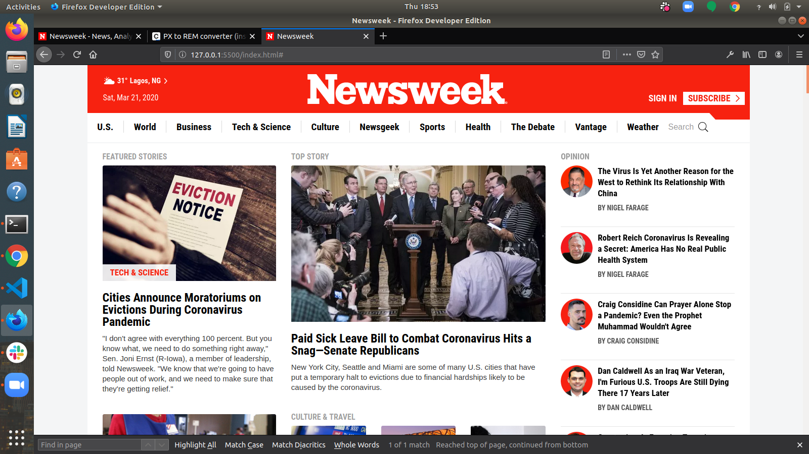

# Newsweek Homepage Clone

> This project is a clone of ["Newsweek" Website](http://newsweek.com/), created to practice responsive layouts using the Bootstrap framework.

## Features

- Responsive layout: support to different screen sizes
- Positioning using the Bootstrap grid and flex
- Icons from font-awesome and genericons.

## Built With

- HTML5
- CSS3

## Live Demo

["Newsweek Website Clone](https://raw.githack.com/ezeilo-su/newsweek-clone/dev/index.html)

## Author

👤 **Sunday Uche Ezeilo**

- Github: [@sundayezeilo](https://github.com/ezeilo-su)
- Twitter: [@SundayEzeilo](https://twitter.com/SundayEzeilo)
- Linkedin: [Sunday Ezeilo](https://www.linkedin.com/in/sunday-ezeilo-a6a67664/)

## 🤝 Contributing

Contributions, issues and feature requests are welcome!

Feel free to check the [issues page](issues/).

## Show your support

Give a ⭐️ if you like this project!
